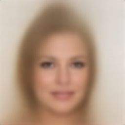
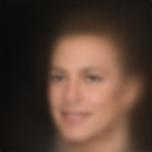
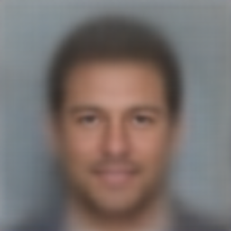

# **Exploring Latent Space via VAE**

    
     

VAE and latent space are the inseparable duo in representation learning. VAE uses the latent space as a constraint on how excellent data reconstruction should be. With a controlled latent space, we can simply regulate the data-generating process. On this occasion, we will go on an excursion across a latent space. We'll see what we can do in this "Chamber of Secrets." In the latent space, latent vectors (or variables) coexist harmoniously. Let's see "Fantastic Latent Vectors and How to Find Them."

## **Latent Space**

As the name suggests, a latent space is a hidden abstraction created by compressing higher-dimensional data. There exist latent vectors that lie in the space and are used to reconstruct the observed data manifold. The **manifold hypothesis** roughly posits that real-world data $\mathbf{x} \in \mathbb{R}^D$ lies near a manifold $\mathcal{M} \subset \mathbb{R}^D$. Then:

* Latent vector $\mathbf{z} \in \mathbb{R}^d$
* There exists a **smooth** function $f: \mathbb{R}^d \to \mathcal{M} \subset \mathbb{R}^D$, such that $\mathbf{x} \approx f(\mathbf{z})$

Let $\mathbf{x} \in \mathbb{R}^D$ be the observed data. We assume that there is a **latent vector** $\mathbf{z} \in \mathbb{R}^d$ (with $d < D$) such that:

$$
\mathbf{x} = f(\mathbf{z}) + \text{noise}
$$

The latent space is the space of all possible $\mathbf{z}$'s. Here $f(\mathbf{z})$ can be the decoder of VAE or the generator of GAN.

## **VAE (Variational Auto Encoder)**

In our interest, the purpose of VAEs is to create a meaningful latent space from a dataset. VAEs have two parts (similar to the basic autoencoder): the encoder and the decoder. The encoder compresses the data into latent vectors that live in a constrained latent space (unlike the vanilla autoencoder). The decoder maps the latent vectors back to the data. As generative models (by the commandment of MLE (Maximum Likelihood Estimation)), VAEs attempt to maximize the **marginal likelihood** of the data. 

$$
p\_\theta(\mathbf{x}) = \int p\_\theta(\mathbf{x}, \mathbf{z}) d\mathbf{z} = \int p\_\theta(\mathbf{x} | \mathbf{z}) p(\mathbf{z}) d\mathbf{z}
$$

Where:

* $p\_\theta(\mathbf{x}, \mathbf{z})$ is the **joint distribution**.
* $p(\mathbf{z})$ is the latent space distribution, hence $\mathbf{z} \sim p(\mathbf{z})$. 
* $p\_\theta(\mathbf{x} | \mathbf{z})$ is the decoder, hence $\mathbf{x} \sim p\_\theta(\mathbf{x} | \mathbf{z})$.

Yet, there is a catch. Computing the marginal likelihood as is will be intractable, because the encoder is implemented in a neural network (i.e., notoriously non-linear), and the integral is over a high-dimensional latent space. Enter variational inference. We can utilize an **approximate posterior** (i.e., the encoder) $q\_\phi(\mathbf{z} | \mathbf{x})$, parameterized by $\phi$, to approximate the true posterior $p\_\theta(\mathbf{z} | \mathbf{x})$. Thus, we can calculate:

* We start with the log marginal likelihood:

$$
\log p\_\theta(\mathbf{x}) = \log \int p\_\theta(\mathbf{x}, \mathbf{z}) d\mathbf{z}
$$

* Multiply and divide by $q_\phi(\mathbf{z}|\mathbf{x})$:

$$
= \log \int q_\phi(\mathbf{z}|\mathbf{x}) \frac{p\_\theta(\mathbf{x}, \mathbf{z})}{q\_\phi(\mathbf{z}|\mathbf{x})} d\mathbf{z}
$$

* Apply **Jensen's Inequality** to the log of an expectation:

$$
\log p\_\theta(\mathbf{x}) \geq \mathbb{E}\_{q\_\phi(\mathbf{z}|\mathbf{x})} \left\[ \log \frac{p\_\theta(\mathbf{x}, \mathbf{z})}{q\_\phi(\mathbf{z}|\mathbf{x})} \right]
$$

* This defines the **Evidence Lower Bound (ELBO)**:

$$
\mathcal{L}(\theta, \phi; \mathbf{x}) = \mathbb{E}\_{q\_\phi(\mathbf{z}|\mathbf{x})} \left\[ \log p\_\theta(\mathbf{x}, \mathbf{z}) - \log q\_\phi(\mathbf{z}|\mathbf{x}) \right]
$$

* Decomposing the joint:

$$
= \mathbb{E}\_{q\_\phi(\mathbf{z}|\mathbf{x})} \left\[ \log p\_\theta(\mathbf{x}|\mathbf{z}) \right] - D\_{\mathrm{KL}} \left( q\_\phi(\mathbf{z}|\mathbf{x}) || p(\mathbf{z}) \right)
$$

* So the final form is:

$$
\log p\_\theta(\mathbf{x}) \geq \mathcal{L}(\theta, \phi; \mathbf{x}) = \underbrace{\mathbb{E}\_{q\_\phi(\mathbf{z}|\mathbf{x})} \[\log p\_\theta(\mathbf{x}|\mathbf{z})]}\_{\text{Reconstruction Term}} - \underbrace{D\_{\mathrm{KL}} \left( q\_\phi(\mathbf{z}|\mathbf{x}) || p(\mathbf{z}) \right)}\_{\text{Regularization Term}}
$$

All in all, the VAE's training objective is to maximize the Evidence Lower Bound (ELBO), which is typically minimized as a loss function:

$$
\mathcal{L}\_{\text{VAE}}(\theta, \phi; \mathbf{x}) = - \mathbb{E}\_{q\_\phi(\mathbf{z}|\mathbf{x})} \[\log p\_\theta(\mathbf{x}|\mathbf{z})] + D\_{\mathrm{KL}} \left( q\_\phi(\mathbf{z}|\mathbf{x}) || p(\mathbf{z}) \right)
$$

## **Latent Space Exploration via UMAP**

As aforementioned, the latent space is typically high-dimensional (albeit lower than the data). To make our excursion manageable, we will use UMAP for further compression to 2D vectors/embeddings. UMAP aims to build a fuzzy topological representation of the manifold and optimize low-D embedding to preserve it. It models high-D neighborhoods with fuzzy simplicial sets (i.e., probabilistic graphs). It optimizes cross-entropy between fuzzy sets in high-D and low-D:

$$
\mathcal{L} = \sum\_{(i,j)} \[p\_{ij} \log q\_{ij} + (1 - p\_{ij}) \log (1 - q\_{ij})]
$$

Now, we are ready for:

* **Sampling**: draw $z \sim \mathcal{N}(0, I)$, decode to new samples
* **Interpolation**: linear interpolation in $z$
* **Latent traversal**: fix all dims of $z$ except one → observe effect on output

## **Exploration Result**

### **Random Sampling**

    Some images that are decoded from latent vectors drawn from a normal distribution 

### **Latent Vector Interpolation**

UMAP is by default an unsupervised learning, but we can add labels to make it supervised. By conditioning on labels, we can target our desired attribute from the dataset (e.g., the CelebA dataset) since the compressed latent embeddings will cluster neatly. This is useful for latent vector interpolation. By doing so, we can see decoded images under a linear transition between a negative vector and a positive vector. These vectors can be obtained by finding the centroid of each cluster. Don't forget to add noise based on the dispersion of the cluster. This will sample a vector of the relevant member in the cluster.

* 👩‍🦳 Gray Hair

    Interpolation from a non-gray-haired person to a gray-haired person  

    Animated interpolation from a non-gray-haired person to a gray-haired person  

* ⬛️ Black Hair

    Interpolation from a non-black-haired person to a black-haired person  

    Animated interpolation from a non-black-haired person to a black-haired person  

* 🟫 Brown Hair

    Interpolation from a non-brown-haired person to a brown-haired person  

    Animated interpolation from a non-brown-haired person to a brown-haired person  

* 👱 Blond Hair

    Interpolation from a non-blond-haired person to a blond-haired person  

    Animated interpolation from a non-blond-haired person to a blond-haired person  

* 💥 Bangs

    Interpolation from a person without bangs to a person with bangs  

    Animated interpolation from a person without bangs to a person with bangs  

* 👨‍🦲 Bald

    Interpolation from a person with hair to a person without hair 

    Animated interpolation from a person with hair to a person without hair 

* ❌🧔‍♂️ No Beard

    Interpolation from a person with a beard to a person without a beard 

    Animated interpolation from a person with a beard to a person without a beard 

* ☀️ Pale Skin

    Interpolation from a non-pale-skinned person to a person with pale skin 

    Animated interpolation from a non-pale-skinned person to a person with pale skin 

* 👄 Mouth Slightly Open

    Interpolation from a person with a mouth closed to a person with a mouth slightly open 

    Animated interpolation from a person with a mouth closed to a person with a mouth slightly open 

* 😃 Smiling

    Interpolation from a non-smiling person to a smiling person 

    Animated interpolation from a non-smiling person to a smiling person 

* 🥚 Oval Face

    Interpolation from a non-oval-faced person to an oval-faced person 

    Animated interpolation from a non-oval-faced person to an oval-faced person 

* 👨‍🦱 Male

    Interpolation from a female to a male 

    Animated interpolation from a female to a male 

### **Latent Space Traversal**

Given the 2D latent space visualized based on the target attribute, we can pinpoint our desired location in the space and decode it to the respective image.

    The 2D latent space in a 15 × 15 image grid 

<table>

&nbsp;   <tr>

&nbsp;       <td align="center"> 

&nbsp;           

&nbsp;           Image at (-0.857, 0.0)

&nbsp;       </td>

&nbsp;       <td align="center"> 

&nbsp;           

&nbsp;           Image at origin (0.0, 0.0)

&nbsp;       </td>

&nbsp;       <td align="center"> 

&nbsp;           

&nbsp;           Image at (0.857, 0.0)

&nbsp;       </td>

&nbsp;   </tr>

</table>

## **References**

1. D. P. Kingma and M. Welling, "Auto-Encoding Variational Bayes," arXiv:1312.6114 [stat.ML], 2022. [Online]. Available: [https://arxiv.org/abs/1312.6114](https://arxiv.org/abs/1312.6114)
2. [L. Cayton and others, "Algorithms for manifold learning," *Univ. of California at San Diego Tech. Rep.*, vol. 12, no. 1-17, pp. 1, 2005.](https://cseweb.ucsd.edu/~lcayton/resexam.pdf)
3. [Z. Liu, P. Luo, X. Wang, and X. Tang, "Deep Learning Face Attributes in the Wild," in *Proc. Int. Conf. Comput. Vision (ICCV)*, Dec. 2015.](https://openaccess.thecvf.com/content_iccv_2015/papers/Liu_Deep_Learning_Face_ICCV_2015_paper.pdf)
4. [L. McInnes, J. Healy, and J. Melville, "Umap: Uniform manifold approximation and projection for dimension reduction," *arXiv preprint arXiv:1802.03426*, 2018.](https://arxiv.org/pdf/1802.03426)
